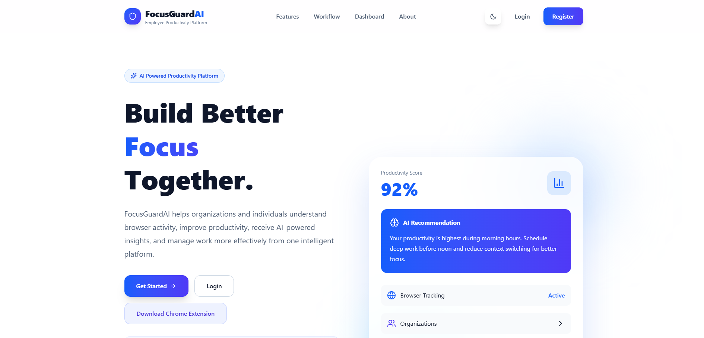

# 🎯 FocusGuard AI

### AI-Powered Human Attention Preservation & Digital Distraction Intelligence Platform

<p>
  Turn digital activity into actionable productivity insights.
</p>


**Your browser knows exactly where your focus went today. Do you?** 🕵️‍♂️

FocusGuard AI watches the tabs, learns your patterns, and hands you the receipts - no guilt trips, just data. Install the extension, browse like you normally would, and let the AI tell you where your hours actually go.

###  [ Try FocusGuard AI Live ](https://focusguard-platform.vercel.app) - takes 2 minutes, zero commitment

<br>



</div>

---

## 📑 Table of Contents

- [🌐 Live Demo](#-live-demo)
- [🧩 Before You Start](#-before-you-start--one-tiny-thing)
- [✨ Key Features](#-key-features)
- [👥 User Roles](#-user-roles)
- [🛠️ Tech Stack](#️-tech-stack)
- [🏗️ Architecture](#️-architecture)
- [🚀 Local Setup](#-local-setup)
  - [Prerequisites](#prerequisites)
  - [1. Backend Setup](#1-backend-setup)
  - [2. Frontend Setup](#2-frontend-setup)
  - [3. Chrome Extension Setup](#3-chrome-extension-setup)
- [🔐 Environment Variables](#-environment-variables)
- [🧪 Verification](#-verification)
- [👤 Author](#-author)

---

## 🌐 Live Demo

| Service | Link |
|---|---|
| **Live Website** | [FocusGuard AI](https://focusguard-platform.vercel.app) |
| **Backend API** | [FocusGuard Backend](https://focusguard-backend-xn94.onrender.com) |
| **API Documentation** | [Swagger UI](https://focusguard-backend-xn94.onrender.com/api/docs/) |
| **Health Check** | [Backend Health](https://focusguard-backend-xn94.onrender.com/health/) |

> **🚀 Deployment:** The frontend is deployed on Vercel, the Django backend runs on Render, PostgreSQL is hosted on Supabase, and Redis powers the real-time layer through Upstash.

---

## 🧩 Before You Start — One Tiny Thing!

> **Want the full FocusGuard experience? 👀**
>
> There's just one tiny extra step — the Chrome Extension needs to be installed manually before browser activity tracking can work.
>
> Why? Because FocusGuard AI is proudly running on a **₹0 budget** 💸😄, so the extension isn't sitting in the Chrome Web Store yet.
>
> No worries though — Chrome makes loading it manually pretty easy!

### 📦 Install the Chrome Extension

1. **Download the FocusGuard AI Extension**
 [⬇️ Download Extension](https://focusguard-platform.vercel.app/FocusGuard-Extension.zip)
2. **Extract** the ZIP file.
3. Open Chrome and go to:
   ```text
   chrome://extensions
   ```
4. Turn on **Developer mode**.
5. Click **Load unpacked**.
6. Select the extracted **`FocusGuard-Extension`** folder.
7. Open the extension, sign in, and you're ready to go. 🎯

---

## ✨ Key Features

- 📊 **Productivity Analytics** — Activity tracking, productivity scores, focus goals, trends & reports
- 🧠 **AI Intelligence** — Website categorization, AI recommendations, AI Coach, chatbot & productivity insights
- 🏢 **Role-Based Management** — Dedicated Employee, Organization Admin & Super Admin dashboards
- 🌐 **Chrome Extension** — Real-time browser activity tracking, productivity monitoring, idle detection & automatic synchronization
- 🔔 **Smart Notifications** — Configurable productive, non-productive & idle notifications with real-time delivery
- ⚡ **Real-Time Communication** — WebSocket-based updates powered by Django Channels and Redis
- 🌍 **Multilingual Support** — Multi-language interface with i18next and translation fallback
- 🌙 **Modern UI** — Responsive interface with Light / Dark Mode
- 🔐 **Secure Authentication** — JWT authentication, role-based access control & account management

---

## 👥 User Roles

FocusGuard AI provides role-based access for three major user types:

### 👤 Employee / Normal User
Provides personal productivity tracking and focus-management features.

### 🏢 Organization Admin
Manages employees and monitors productivity at the organization level.

### 👑 Super Admin
Manages organizations, users, and system-level administration.

Each role has its own dashboard and permissions.

---

## 🛠️ Tech Stack

| Category | Technologies |
|---|---|
| **Frontend** | React 19, JavaScript, Vite, React Router, Context API, Tailwind CSS, Material UI, Recharts, Axios |
| **Backend** | Python, Django 6, Django REST Framework, PostgreSQL, Django ORM, JWT Authentication |
| **Real-Time** | Django Channels, WebSockets, Daphne, Redis, channels_redis |
| **AI & Intelligence** | Google Gemini, Groq, Sarvam AI |
| **Chrome Extension** | JavaScript, Chrome Extension APIs, Manifest V3 |
| **Internationalization** | i18next, react-i18next |
| **Deployment & Infrastructure** | Vercel, Render, Supabase, Upstash Redis, Cloudflare Workers |
| **Development Tools** | Git, GitHub, VS Code, Postman |

---

## 🏗️ Architecture

FocusGuard AI follows a modular architecture that connects browser activity tracking, the web application, backend services, database, analytics, and AI features.

### System Flow

```
Chrome Extension
      ↓
React Frontend
      ↓
Django REST API
      ↓
PostgreSQL Database
      ↓
AI & Analytics Services
      ↓
Productivity Insights & Reports
```

### Architecture Components

| Component | Responsibility |
|---|---|
| 🧩 **Chrome Extension** | Captures browser activity, tracks productivity and idle states, and synchronizes activity data with the backend. |
| ⚛️ **React Frontend** | Provides employee, organization admin, and super admin dashboards, analytics, AI features, settings, and role-based interfaces. |
| 🐍 **Django REST API** | Handles authentication, permissions, business logic, API requests, activity processing, and communication between application services. |
| ⚡ **Real-Time Layer** | Uses Django Channels, WebSockets, Daphne, and Redis to deliver real-time notifications and application updates. |
| 🗄️ **PostgreSQL** | Persists users, organizations, activities, goals, notifications, analytics data, and other application records. |
| 🤖 **AI Services** | Powers website categorization, productivity analysis, recommendations, AI-assisted features, and intelligent interactions using Gemini, Groq, and Sarvam AI. |
| 📊 **Analytics & Insights** | Processes tracked activity into productivity scores, trends, reports, focus insights, and personalized recommendations. |

### Data Flow

```
Browser Activity → Extension → REST API → Database & Processing → Analytics / AI → Dashboard
```

---

## 🚀 Local Setup

### Prerequisites

Before running FocusGuard AI locally, make sure the following are installed:

- Python 3.12+
- Node.js 20+
- npm
- PostgreSQL
- Google Chrome
- Git

---

### 1. Backend Setup

Navigate to the backend directory:

```bash
cd FocusGuard-Backend
```

Create a Python virtual environment:

```bash
python -m venv .venv
```

**Windows — Activate the virtual environment:**

```bash
.\.venv\Scripts\Activate.ps1
```

**macOS / Linux — Activate the virtual environment:**

```bash
source .venv/bin/activate
```

Install the required dependencies:

```bash
pip install -r requirements.txt
```

Configure your backend environment variables in:

```
FocusGuard-Backend/.env
```

> See the [Environment Variables](#-environment-variables) section below for the full list of required keys.

Run database migrations:

```bash
python manage.py migrate
```

Create a Django superuser if required:

```bash
python manage.py createsuperuser
```

Start the backend server:

```bash
python manage.py runserver
```

| Resource | URL |
|---|---|
| **Backend** | `http://127.0.0.1:8000` |
| **API** | `http://127.0.0.1:8000/api` |
| **API Documentation** | `http://127.0.0.1:8000/api/docs/` |
| **OpenAPI Schema** | `http://127.0.0.1:8000/api/schema/` |

---

### 2. Frontend Setup

Open a new terminal and navigate to the frontend directory:

```bash
cd FocusGuard-Frontend
```

Install dependencies:

```bash
npm install
```

Start the development server:

```bash
npm run dev
```

**Frontend:** `http://localhost:3000`

---

### 3. Chrome Extension Setup

The FocusGuard AI Chrome Extension is responsible for browser activity tracking, productivity monitoring, idle detection, and automatic activity synchronization with the backend.

> **Note:** The backend and frontend must be running before using the extension.

#### Load the Extension

1. Open **Google Chrome**.
2. Navigate to:
   ```text
   chrome://extensions
   ```
3. Enable **Developer mode**.
4. Click **Load unpacked**.
5. Navigate to the cloned FocusGuard AI project.
6. Select the **`FocusGuard-Extension`** folder.
7. The FocusGuard AI extension will now appear in Chrome.
8. Pin the extension to the Chrome toolbar for easy access.

#### Extension Usage

1. Click the **FocusGuard AI** extension and sign in.
2. Enable activity tracking.
3. Browse websites normally.
4. The extension will track browser activity and synchronize the collected data with the backend.
5. Open the **FocusGuard AI web dashboard** to view productivity analytics, activity history, AI insights, goals, and other features.

> **Note:** Keep the Django backend and React frontend running during local development.

---

## 🔐 Environment Variables

The FocusGuard AI backend requires environment variables for database access, email services, and AI integrations.

Create the following file:

```
FocusGuard-Backend/.env
```

Use your own local credentials, email configuration, and API keys:

```env
SECRET_KEY=generate-a-new-django-secret

DB_NAME=focusguard
DB_USER=postgres
DB_PASSWORD=your-local-postgres-password
DB_HOST=127.0.0.1
DB_PORT=5432

EMAIL_HOST=smtp.gmail.com
EMAIL_PORT=587
EMAIL_HOST_USER=your-email@example.com
EMAIL_HOST_PASSWORD=your-email-app-password
EMAIL_USE_TLS=True
DEFAULT_FROM_EMAIL=your-email@example.com

GROQ_API_KEY=your-groq-api-key
GROQ_MODEL=your-groq-model

GEMINI_RECOMMENDATION_API_KEY=your-gemini-api-key
GEMINI_CATEGORY_API_KEY=your-gemini-api-key

CHATBOT_GEMINI_API_KEY=your-gemini-api-key
CHATBOT_GROQ_API_KEY=your-groq-api-key

FOCUS_PLAN_GEMINI_API_KEY=your-gemini-api-key
FOCUS_PLAN_GROQ_API_KEY=your-groq-api-key

SARVAM_API_KEY=your-sarvam-api-key
```

> ⚠️ **Important:** Replace all placeholder values with your own credentials and API keys.
> **Never** commit `.env` files, API keys, passwords, or authentication tokens to GitHub.

---

## 🧪 Verification

After completing the setup, verify that the project is working correctly.

### Backend

From the `FocusGuard-Backend` directory, run:

```bash
python manage.py check
```

### Frontend

From the `FocusGuard-Frontend` directory, build the production bundle:

```bash
npm run build
```

If linting is configured, run:

```bash
npm run lint
```

---

## 👤 Author

**Arnab**
GitHub: [arnab-builds](https://github.com/arnab-builds)

---

<div align="center">

If you find FocusGuard AI useful, consider giving the repo a ⭐

</div>


